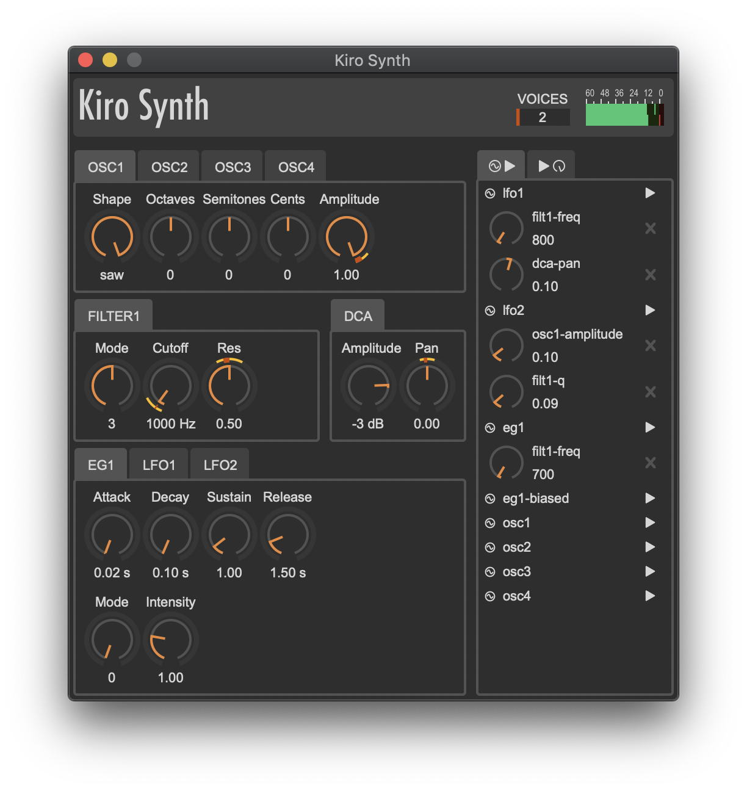
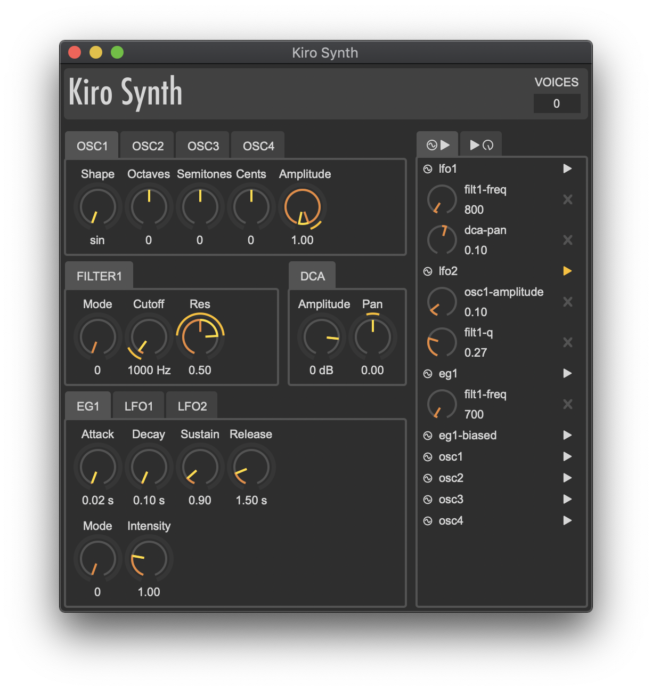

# Kiro Synth

This is my 4rd iteration on building a synthesiser ;-)

This time, these are my goals:

- The synth logic can be used in embedded systems (I plan to build actual hardware from this).
- Internally it is like a modular synth, where all the blocks (Osc, Lfo, Filter, Env, Dca, ...) can be patched together using a simple Rust DSL

This is the very beginning of this project and I plan to take quite some time developing it, but it already makes some noise ;-)

```bash
cd kiro-synth-host
cargo run --release
```

NOTE: You have to connect your MIDI keyboard before starting the synth. Also it only supports MacOS right now.

# Screenshots




## Roadmap

- [x] Basic synth pieces: Oscillator, EG, LFO, Filter, DCA
- [x] Rust DSL to build the synth graph as a program
- [x] Basic voice management
- [x] Parameters can be changed from MIDI events or a UI
- [x] Controlling parameters from a Druid UI
- [x] Modulation of parameters through a modulation matrix
- [x] The modulation matrix can be tuned from the UI
- [x] UI feedback for the modulations
- [x] UI feedback for the number of voices
- [x] UI feedback for the output levels
- [ ] Fix modulation parameters value ranges
- [ ] Fix LFO phase parameter
- [ ] Add note expression as modulation sources (velocity, pitch, modwheel, after touch)
- [ ] Patch management from configuration
- [ ] Patch management from the UI
- [ ] Internal signals explorer (oscilloscope, spectrum analyzer, Peak/RMS level meter)
- [ ] Improve the program with more blocks (add one more EG and LFO)
- [ ] Improve the program graph to include global oscillators parameters (octave, semitones, cents, drift, filter output)
- [ ] Improve the program graph to allow FM synthesis using the oscillators
- [ ] Improve the program graph to add more parameters for the oscillators (filter output)
- [ ] Add a square waveshape (including new parameter for width)
- [ ] Add noise waveshapes
- [ ] Add more filters
- [ ] Filter mode parameter shows the filter name in the UI
- [ ] Improve the Knob widget to support logarithmic parameters
- [ ] Unison ?
- [ ] UI feedback for the CPU usage
- [ ] ...
